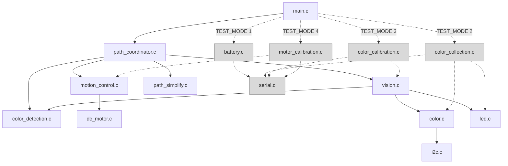

# ECM buggy manual

## Introduction

This project aims to develop an autonomous buggy designed for "navigational search and rescue" style courses (as might be found in a mine), where movement decisions are encoded by coloured cards placed along the maze walls. The buggy must repeatedly locate a card, approach it without collision, identify its colour, and translate that colour into a navigation instruction (e.g., turn 90°, turn 135°, reverse then turn). After reaching the final Finish card (white), the buggy must autonomously return to its starting position. If the finish cannot be located the buggy should enter a safe recovery mode and return home.

The environment is a constrained maze built from black plywood walls with coloured cards attached at decision points. The colour set includes multiple colors that can be close under real lighting (for example white vs pink), so the system must be robust to brightness changes, sensor noise, and varying card distance. Because the buggy's navigation is entirely driven by card readings (the course layout and sequence are unknown in advance), reliable colour recognition and repeatable vehicle control are the two major technical components of the solution.

## Motion Control

### Bi-directional linear motion control

The linear movement of the buggy is controlled in increments equal to one third of the maze wall length, which corresponds approximately to the length of the buggy. This discrete step size allows the robot to align with the grid-based structure of the maze, enabling more accurate path tracking and consistent positioning at each decision point. As a result, movement control becomes simpler and navigation decisions can be executed more reliably.

ADD IMAGE

**Advantages for returning home:**

Incremental motion simplifies the return home functionality. Rather than storing precise distances or timings, which would increase memory and computational requirements, the buggy records movement increments and turns in a stack. Once the finish card is reached, the stack is inverted and executed in reverse, allowing the buggy to retrace its path efficiently. Consecutive identical movements are compressed into a single instruction with an associated step count to further reduce memory usage.

Although the buggy effectively moves continuously, its position is tracked using discrete increments, where one unit corresponds to one third of the maze wall length. Each increment is calibrated using a trapezoidal motor power profile with ramp-up, constant power, and ramp-down phases, where the area under the power-time curve determines the distance travelled.

Initially, multiple increments were performed using a single trapezoidal profile with an extended constant-power phase. However, testing showed that executing the same discrete increments used during exploration provided more reliable and repeatable motion.

Code Breakdown:

```
/*
 * Execute one movement action on the robot.
 * Input: controller_state = motion controller data, action_step = action type and step size.
 * Checking the action type, driving the motors with the correct direction and power, waiting for the calibrated time, then stopping.
 * Step size allows one action command to repeat multiple motion units.
 */
void executeAction(motion_controller *controller_state, const ActionStep *action_step)
{
    // Cache the left and right motor structs locally for shorter motion calls.
    DC_motor *mL = &(controller_state->mL);
    DC_motor *mR = &(controller_state->mR);
    // step_size tells us how many motion units this action should cover.
    const unsigned char step_size = action_step->step_size;
    // Reused to hold the calibrated delay for the current motor command.
    unsigned int duration_ms;


    switch (action_step->action) {
        case ACTION_FORWARD:
            // Each pair of step units uses one full calibrated forward move.
            for (int i = 0; i < step_size/2; i++){  
            fullSpeedAhead(mL, mR, FWD_LEFT_POWER, FWD_RIGHT_POWER);
            duration_ms = controller_state->delays.FORWARD_BASE_UNIT_MS;
            delayMs(duration_ms);
            stop(mL, mR);  
            }  
            // An odd remaining step is handled as a shorter half-unit move.
            if (step_size % 2 == 1) {
            fullSpeedAhead(mL, mR, FWD_LEFT_POWER, FWD_RIGHT_POWER);
            duration_ms = HALF_BASE_UNIT_MS;
            delayMs(duration_ms);
            stop(mL, mR);  
            }
            break;

        default:
            // Unknown actions fail safe by stopping both motors.
            stop(mL, mR);
            break;
    }

}

```

### Turning

Similar to linear motion, we adopt an incremental approach for turning. The smallest unit turn required in the maze is 45°, so we adopt and calibrate a trapezium-shaped wave to correspond to a left/right turn of 45°. For 90°, 135° or 180° turns, we simply repeat the 45° turn the required number of times. Whilst turns > 45° are not completely smooth, this approach requires no more than 4 pulsations, simplifying the calibration process, and minimising errors. Since the low-cost buggy's left and right motors are unlikely to behave identically, we calibrate and use seperate left and right 45° turns. However, after testing we decided to include a separate calibration for the 180° turn to improve accuracy. This is shown in the following code:

#### Code extract

```c

        case ACTION_TURN_LEFT:
            // Let the buggy settle before starting a turn.
            __delay_ms(200);  
            // Do larger turn blocks first using the dedicated 180-degree timing.
            for (int i = 0; i < step_size/4; i++){   
            turnLeft(mL, mR, TURN_LEFT_POWER, TURN_RIGHT_POWER);
            duration_ms = controller_state->delays.TURN_LEFT_180_MS;
            delayMs(duration_ms);
            stop(mL, mR);
            // Pause between turn segments so buggy settles.
            __delay_ms(200);
            }  
            // Finish any remaining turn units with the base left-turn calibration.
            for (int i = 0; i < step_size % 4; i++){   
            turnLeft(mL, mR, TURN_LEFT_POWER, TURN_RIGHT_POWER);
            duration_ms = controller_state->delays.TURN_LEFT_BASE_UNIT_MS;
            delayMs(duration_ms);
            stop(mL, mR);
            __delay_ms(200);
            }  
            break;
```

## Forward Mine Exploration Strategy

Whilst exploring the maze the buggy detects the colour cards and follows their instructions. To achieve an effective and efficient operation, the following logic was implemented:

1. Incremental Forward Motion
2. Wall Detection
3. Color Detection and Alignment
4. Follow Colour card Navigation Instruction
5. Record completed movement operations

This can also be seen in the following Figure:

TODO) Add Figure

##### Incremental Forward Motion

Forward motion is performed through a continuous motion, but the position is tracked incrementally through the following implementation:

##### Wall Detection

At the end of each incremental step, the clear channel from the Color Click board is used to detect the wall of the maze, by comparing the clear channel value against a threshold:

##### Color Detection and Alignment

Once the buggy detects the wall it drives forward (to align) and implements the colour detection logic to capture RGB readings and record the colour of the card:

##### Follow Colour card Navigation Instruction

* **Red:** Reverse 1 step, turn 90° right, move forward
* **Green:** Reverse 1 step, turn 90° left, move forward
* **Blue:** Reverse 1 step, turn 180°, reverse to re-align, move forward
* **Yellow:** Reverse 1 square (3 steps), turn 90° right, move forward
* **Pink:** Reverse 1 square (3 steps), turn 90° left, move forward
* **Orange:** Reverse 1 step, turn 135° right, move forward
* **Light Blue:** Reverse 1 step, turn 135° left, move forward
* **White:** Flash LEDs to indicate end of Maze, return home
* **Black:** Flash LEDs to indicate got lost, return home

##### Record completed movement operations

Once a linear movment or turn is completed it is recorded on the instruction stack:

### Return Home Logic

The Return Home Logic allows the buggy to accurately retrace its route through the maze and return to the starting position after the finish card is detected. The system records the sequence of movement instructions executed during exploration and uses these to reconstruct the path in reverse. It relies on three steps: path recording (in `path_coordinator.c`), path simplification (in `path_simplify.c`), and path reversal (in `path_coordinator.c`). Of these, path simplification is the most complicated part.

##### Path Recording

During forward navigation, each movement command performed by the buggy (such as moving forward or executing a turn) is stored in an instruction stack. This stack maintains the order of all actions taken while exploring the maze and naturally compresses consecutive repetitions of the same type of action by storing (action, size) pairs.

##### Path Simplification

Path simplification is used to optimise the path taken by the buggy on the way back home. This is primarily done by cancelling out opposing action pairs (e.g. go forwards followed by going back).

After each wall detection, our algorithm does an align step with the wall to avoid errors building up, which is stored as a separate type of action. To avoid errors building up we might want to keep some of these steps but keeping all of them prevents any significant path simplification. As such we have three different modes to choose from when compiling: `SIMPLIFY_KEEP_ALL_ALIGNS `which does not simplify the path in the return home,`SIMPLIFY_REMOVE_ALL_ALIGNS` which produces the fastest way back, or `SIMPLIFY_KEEP_STEP1_ALIGNS` which only keeps aligns around a forward or reverse motion of step size 1 (1/3 of a block), which aims to strike a balance between simplifying the path while maintaning aligns that are quick to carry out.


A more experimental path simplification feature is the 135-degree shortcutting mode which tries to approximate the N-like path of matches of opposite 135 degree turn pairs through a direct connection. This requires travelling back through a different path so it might not always work and can be enabled/disabled through a separate `enum`.


The simplifier can optionally replace a paired 135-degree pattern with a shorter axis-aligned approximation (shown in the above two figures), then it removes alignment steps according to the selected `SimplifyMode`, and finally it compacts the stack, merging identical neighbouring steps and canceling opposite pairs such as `FORWARD` vs `REVERSE` or `TURN_LEFT` vs `TURN_RIGHT`.

To design and debug this feature, we created some test cases and ran the algorithm on such cases, to confirm that it appropriately simplified example paths.To achieve this we added another c script (`path_simplify_test.c`) that can read files (see `test_cases/`) describing expected paths before and after simplification. This file is then intended to be compiled and executed on our computer and not on the MCU. We also combined this with a python script (`plot_paths.py`) that can parse the same files to produce visualisations of the test cases (see `test_cases/plots`; also used for the plots above) that can be used to quickly visually check that the test cases capture the desired behaviour.

This approach makes any modifications to this logic simple: it just takes writing a new test case describing the wanted behaviour and modifying the logic until both the new and existing test cases run successfully. We found this to work very well for path simplification, because it has complicated internal logic but takes in a well defined input and produces a well defined output (and is independent of any physical hardware).

We also note that the simplification function modifies the instruction stack "in place" (i.e. without having to create a new instruction stack) for increased efficiency.

##### Path Reversal - No simplification

Once the finish card is detected, the buggy performs a 180° rotation and carries out every action in the stack in reverse order and inverted using the following rules:

* A **left turn** becomes a **right turn**.
* A **right turn** becomes a **left turn**.
* A **forward wall alignment action** becomes a **reverse wall alignment action**.
* A **reverse wall alignment action** becomes a **forward wall alignment action**.
* **All other actions are unaffected**.

Finally, the buggy performs a final 180° rotation after returning to its starting location in order to face the direction it started in.

#### Execution

By sequentially applying the inverse of each stored instruction, the buggy systematically retraces its route until the stack is empty, at which point it has returned to its original starting position. This approach provides a reliable and memory-efficient solution for returning home.

##### Advantages of the Un-Simplified Return Home Logic:

* **Low memory usage** - Only movement instructions are stored in a stack rather than full position coordinates or a map of the maze.
* **Computational efficiency** - Returning home simply requires reversing the instruction order and executing inverse actions, avoiding complex path-planning algorithms.
* **Scalability** - The method works for both simple and complex mazes since the number of stored instructions only grows with the number of movements made.
* **Accurate path retracing** - By undoing the exact sequence of actions taken during exploration, the buggy follows the same route back with high positional consistency.
* **Implementation simplicity** - The logic is straightforward to implement using basic data structures and motor control commands, maintaining system reliability and ease of debugging.

#### Advantages of the Simplified Return Home logic:

* **Performance**: finish the maze in a considerably faster time and with less movement than without simplification of the return path. In the final demonstration on the largest maze, the simplified path saved 40 seconds.

##### Video Demonstration:

Simplified Return Home for 135 degree turn
[](https://readmes.netlify.app/videoplayer/?url=https://raw.githubusercontent.com/shengj1ang/READMEs/refs/heads/ECM-final-doc/videos_for_doc/path-optimization-135degrees.mp4)
[Download the video](https://raw.githubusercontent.com/shengj1ang/READMEs/refs/heads/ECM-final-doc/videos_for_doc/path-optimization-135degrees.mp4)

Maze with path optimization
[](https://readmes.netlify.app/videoplayer/?url=https://raw.githubusercontent.com/shengj1ang/READMEs/refs/heads/ECM-final-doc/videos_for_doc/final-maze-5-path-optimization.mp4)
[Download the video](https://raw.githubusercontent.com/shengj1ang/READMEs/refs/heads/ECM-final-doc/videos_for_doc/final-maze-5-path-optimization.mp4)

##### Motion Calibration Procedure:

The motion calibration process ensures the buggy moves accurately and consistently within the maze. Because movement is controlled using time-based motor commands rather than wheel encoders, each step (such as moving one-third of a maze wall length) depends on the delay applied to the motors. Calibration therefore adjusts these delay values so that forward motion, reversing, and turning are reliable and repeatable. This is essential because both the navigation and return-home logic rely on these base movements being consistent.

### Purpose of Calibration

The aim of calibration is to adjust the delay values associated with each motion so that the buggy behaves as closely as possible to the intended maze movements. These values are tuned for the testing environment, by accounting for different track surfaces.

The calibration process improves the buggy’s ability to:

* Turn with precise increments of 45° both left and right
* Move forward by **one-third of a maze unit** ,
* Move forward by **one full maze unit** ,
* Reverse by **one-third of a maze unit**,
* Turn 180° left and right.

By calibrating these actions, the buggy is better able to align with the maze grid, respond correctly to colour instructions, and retrace its path when required. Note that the move forward by one full maze unit was conducted to verify the previous calibration for 1/3 step motion. 

### Calibration Implementation

Calibration is run through a dedicated test mode in the main program. When the motor calibration mode is selected, the `calib()` function is called. This initialises the serial output, configures the two push buttons on **RF2** and  **RF3**, and sets up the **RH3** and **RD7** LEDs for visual feedback. The program then waits for the user to press **RF2** before starting the calibration sequence.

The actual motion of the buggy is carried out through the `executeAction()` function. This function applies the correct motor command for the chosen action, waits for a delay based on the stored calibration value, and then stops the motors. In this way, calibration directly updates the same delay values that are later used during normal maze navigation.


Calabration for turning left and turning right

[](https://readmes.netlify.app/videoplayer/?url=https://raw.githubusercontent.com/shengj1ang/READMEs/refs/heads/ECM-final-doc/videos_for_doc/motor-calibration.mp4)
[Download the video](https://raw.githubusercontent.com/shengj1ang/READMEs/refs/heads/ECM-final-doc/videos_for_doc/motor-calibration.mp4)

Calibration for one pluse forward
[](https://readmes.netlify.app/videoplayer/?url=https://raw.githubusercontent.com/shengj1ang/READMEs/refs/heads/ECM-final-doc/videos_for_doc/calibration-for-one-pluse-forward.mp4)
[Download the video](https://raw.githubusercontent.com/shengj1ang/READMEs/refs/heads/ECM-final-doc/videos_for_doc/calibration-for-one-pluse-forward.mp4)


### Key Calibration Modes

The calibration routine is divided into five modes, each corresponding to a specific motion:

**Mode 1 - Left Turn Calibration**

This mode calibrates a 90° left turn. The buggy performs a left turn using two turning units (of 45° each), allowing the delay for left rotation to be adjusted until the turn is accurate.

**Mode 2 - Right Turn Calibration**

This mode calibrates a 90° right turn. The buggy performs a right turn using two turning units (of 45° each), allowing the delay for rightrotation to be adjusted until the turn is accurate.

**Mode 3 - Forward Motion Calibration (1/3 Unit)**

This mode calibrates the short forward movement used as the basic movement step. The buggy moves forward by one-third of a maze unit and the delay is adjusted until the distance is accurate.

**Mode 4 - Forward Motion Calibration (1 Full Unit)**

This mode calibrates a full forward maze unit. This ensures that longer straight movements also remain accurate and that the buggy can align properly with the maze layout.

**Mode 5 - Reverse Motion Calibration (1/3 Unit)**

This mode calibrates the reverse movement used for repositioning and backtracking. The buggy reverses by one-third of a maze unit and the corresponding delay is tuned.

**Mode 6 - Reverse Motion Calibration (1/3 Unit)**

**Mode 5 - Reverse Motion Calibration (1/3 Unit)**

#### Calibration Flow Chart

#### Calibration Execution

Each mode uses the same `calibration_execution()` function. This function first performs the selected motion, then allows the user to modify the associated delay value. The motion is repeated using the updated value until the user is satisfied with the result. This modular approach keeps the code structured and allows the same logic to be reused for all movement types.

#### User Calibration Interaction with Buggy

**Button Controls:**

* **RF2** increases the current delay value
* **RF3** decreases the current delay value
* **RF2 + RF3 together** confirm the delay and move to the next stage of the process

After adjusting the delay, the user is given the option either to **repeat the calibration move** using the new value (pressing RF2) or to **complete calibration of that mode and continue** to the next one (pressing RF3).

**LED Visual Feedback:**

* **RH3** flashes when a delay value is adjusted
* **RD7** flashes when a mode is confirmed or calibration begins

This provides immediate visual feedback to show that the button press has been detected and the input has been accepted, usefull when calibration is completed whilst car is not connected via serial comunication.

# Colour Recognition

To navigate the maze the buggy needs to detect the color of colored cards placed on the walls of the maze. To do so, the buggy uses a **TCS3471 colour sensor** mounted on its front. The sensor measures the intensity of reflected clear, red, green, and blue (CRGB) light from the card surface using photo diodes. To ensure consistent measurements, the cards are illuminated using the buggy’s **tricolour RGB LED** .

Accurate colour recognition requires calibration because sensor readings vary depending on lighting conditions and surface reflectivity. A calibration dataset was therefore collected and used to develop a **classification model** that allows the buggy to identify colours reliably during operation.

---

## 3.2 Calibration Data Collection

A dataset of sensor readings was collected to characterise how each coloured card appears to the sensor under controlled illumination (by recording the distance the card was placed from the colour sensor and ambient light).

##### Setup:

* MIKROE Buggy
* Color Click board
* Coloured cards (red, green, blue, yellow, pink, orange, light blue, white and black)

### Data acquisition procedure

Calibration data was collected using the `collect_data.py` script, which communicates with the buggy over serial communication.

The script collects the data for all color cards and all lighting conditions (Red, Green, Blue, All-On, All-Off).

To do so it first instructs the user to place a coloured card in front of the sensor. After confirmation, the script sends a **start command (`S`)** to the microcontroller, which then performs 500 samples the colour sensor. Finally, each reading is transmitted to the PC and saved to a **CSV file (`data.csv`)** .

Each recorded sample contains:

* Timestamp
* Mode (colour of light from LED)
* Card_label (color of card)
* Distance
* Intensity readings for (Clear, Red, Green and Blue channels)

## Data Analysis

After logging raw RGBC samples to SQLite, the next step was to visualise the data and see if there were any clear patterns.

We started by plotting the raw RGB intensities of readings with all lights on for each category of card.


We next attempted to normalise for the intensity of the readings in two different ways, normalising by the clear (C) sensor reading or normalising by the sum of the RGB values.

We found normalising by the sum of the RGB values to produce more cleanly separately clusters. We also filtered out outliers (C < 500) which produced much cleaner clusters.


In addition to the normalised RGB values, we also found the C readings by themselves to have useful completementary information for distinguishing between card colours (for example the black and white clusters are quite close in normalised RGB but very far apart in C values).


This could be easily repeated for readings under different combinations of lights on (for which we also had the data). However, this turned out to not be necessary as we were able to achieve reliable results using just all lights on.

The final notebook used is in `color_detection/color_detection_analysis.ipynb`.

---

## Classification method

We developed two different classification methods, one based on decision trees and one based on distance to closest clusters.

We ended up getting more consistent results with the approach based on distance to closest clusters which we describe in more detail below, but we also provide details of the decision tree approach in the Appendix.

### Distance Based Classifier

The idea of this approach is to, whenever we want to classify a reading, measure its distance to its colour card cluster mean and pick the nearest cluster.

We decided to use the euclidean norm to measure distances but tried to normalise our dimensions first to avoid any one dimension having a disproportionate impact.

Because the normalised RGB readings are on a 2D plane in 3D, we use principal component analysis (PCA) to find a normalised 2D representation for that plane and also normalised the C readings to have mean 0 and std 1.


The code that produces the mapping to the principal components and produces the coordinates of all the centroids is also in `color_detection/color_detection_analysis.ipynb`.

To implement this in C we multiplied all transformations by 10,000 to avoid using floating point numbers and compared the distances squared instead of the actual distances to avoid having to approximate a square root function.

The final C implementation is in `color_detection.c`.

---

## Mapping from colour → navigation instruction

Once a colour label is predicted, it is mapped to a navigation instruction according to the project specification. The colour recognition module outputs one of:

`black, blue, green, light blue, orange, pink, red, white, yellow`

The navigation controller converts the recognised colour into the corresponding movement command (e.g., right/left/180° turn, finish/return home). The mapping is implemented as a simple lookup (e.g., switch/case) so that navigation logic remains independent from the recognition algorithm.

# Battery Measurement

The battery level is measured at the start. If the battery level is lower than 50%, the red brake light will turn on.

There is also another TEST_MODE to measure the battery level live through serial.

# Video Demonstrations:

## Colour data collection and Live time colour detecetion (debug) through serial

[](https://readmes.netlify.app/videoplayer/?url=https://raw.githubusercontent.com/shengj1ang/READMEs/refs/heads/ECM-final-doc/videos_for_doc/colour-reading-1.mp4)
[Download the video](https://raw.githubusercontent.com/shengj1ang/READMEs/refs/heads/ECM-final-doc/videos_for_doc/colour-reading-1.mp4)

## Live battery measurement through serial


## Maze

Maze-1
[](https://readmes.netlify.app/videoplayer/?url=https://raw.githubusercontent.com/shengj1ang/READMEs/refs/heads/ECM-final-doc/videos_for_doc/final-maze-1.mp4)
[Download the video](https://raw.githubusercontent.com/shengj1ang/READMEs/refs/heads/ECM-final-doc/videos_for_doc/final-maze-1.mp4)

Maze-2
[](https://readmes.netlify.app/videoplayer/?url=https://raw.githubusercontent.com/shengj1ang/READMEs/refs/heads/ECM-final-doc/videos_for_doc/final-maze-3.mp4)
[Download the video](https://raw.githubusercontent.com/shengj1ang/READMEs/refs/heads/ECM-final-doc/videos_for_doc/final-maze-3.mp4)

Maze-3
[](https://readmes.netlify.app/videoplayer/?url=https://raw.githubusercontent.com/shengj1ang/READMEs/refs/heads/ECM-final-doc/videos_for_doc/final-maze-4.mp4)
[Download the video](https://raw.githubusercontent.com/shengj1ang/READMEs/refs/heads/ECM-final-doc/videos_for_doc/final-maze-4.mp4)

Maze3 with path optimization
[](https://readmes.netlify.app/videoplayer/?url=https://raw.githubusercontent.com/shengj1ang/READMEs/refs/heads/ECM-final-doc/videos_for_doc/final-maze-5-path-optimization.mp4)
[Download the video](https://raw.githubusercontent.com/shengj1ang/READMEs/refs/heads/ECM-final-doc/videos_for_doc/final-maze-5-path-optimization.mp4)

# System Design

The maze software separates high-level navigation from the hardware that drives the buggy. The navigation layer works with abstract commands such as forward, reverse, and turns, while lower layers handle PWM, motor pins, LEDs, and sensor I2C transactions.

This abstraction is centred around `ActionType`, `ActionStep`, and the `executeAction()` interface in `motion_control.h`:

```c


typedefenum {


    ACTION_FORWARD,


    ACTION_REVERSE,


    ACTION_STOP,


    ACTION_TURN_LEFT,


    ACTION_TURN_RIGHT,


    ACTION_FORWARD_ALIGN,


    ACTION_REVERSE_ALIGN


} ActionType;


typedefstruct {


    ActionType action;


    unsignedchar step_size;


} ActionStep;


voidexecuteAction(motion_controller *controller_state, const ActionStep *action_step);


```

For the normal maze-navigation build (`TEST_MODE == 0`), the main C-file dependencies are shown in black. Additional C files used by the other `TEST_MODE` options in `main.c` are shaded grey:



`interrupts.h` is not shown because this diagram is limited to `.c` file dependencies, and there is no matching `interrupts.c` in the repository.

This gives the project a clear layer structure. `path_coordinator.c` decides how the robot reacts to walls and colours, `motion_control.c` and `vision.c` turn those decisions into movement and sensing, and the lowest-level modules handle PWM, LEDs, the colour sensor, and I2C communication. `path_simplify.c` is separate from the hardware path entirely and only rewrites recorded actions before the return journey.

The design is modular rather than fully hardware-independent. Replacing the motor driver or colour sensor would still affect lower layers such as `motion_control.c`, `dc_motor.c`, `color.c`, and `i2c.c`, but the maze-solving logic in `path_coordinator.c` could remain mostly unchanged.

# 5. System Optimisation and Efficiency

To keep the software efficient on the PIC18F67K40, the implementation focuses on simple arithmetic, fixed-size storage, compile-time configuration, and lightweight data handling. The final system avoids dynamic memory allocation and keeps most runtime state in local structures passed between functions.

## 5.1 Integer Arithmetic Instead of Floating-Point

Floating-point operations were avoided because they increase both execution cost and code size on a resource-constrained microcontroller. Instead, the project uses integer arithmetic, scaling, and fixed-width integer types such as `uint16_t`, `uint32_t`, and `int64_t`.

In the colour classifier, precomputed integer coefficients are used for feature projection and nearest-class distance calculations:

```c


for (int i = 0; i < 3; ++i) {


    pc1 += RGB_TO_PC1[i] * rgb[i] / intensity;


    pc2 += RGB_TO_PC2[i] * rgb[i] / intensity;


}


```

The path simplifier also uses a fixed-point approximation of `1/sqrt(2)` instead of floating-point:

```c


staticunsignedintdiagonalToAxis(unsignedintdiagonal_steps)


{


    return (diagonal_steps * 181 + 128) >> 8;


}


```

This keeps the algorithms lightweight while still being accurate enough for movement and classification.

## 5.2 Fixed-Size Data Structures and No Dynamic Allocation

The project uses fixed-size arrays and structures rather than `malloc()` or any other dynamic allocation. This makes memory usage predictable at compile time and avoids heap fragmentation.

For example, the path history is stored in a bounded stack:

```c


#define MAX_SEQUENCE_STEPS 100


typedefstruct {


    ActionStep actions[MAX_SEQUENCE_STEPS];


    unsignedchar size;


} ActionStack;


```

The simplifier also uses fixed scratch buffers when rewriting the route:

```c


ActionStep scratch[MAX_SEQUENCE_STEPS];


```

Sensor data is likewise stored in compact structures such as `CRGB`, `vision_observations`, `DC_motor`, and `motion_controller`, so the same memory blocks can be updated and reused throughout execution. No dynamic memory allocation functions are used anywhere in the C source files.

## 5.3 Use of Pointers and Structures

**Reason:** The code passes structures by pointer so that modules can work on the same controller, sensor, and path data without copying whole structures between functions. That keeps memory use predictable and reduces unnecessary duplication on the PIC.

**Implementation examples:**

**a) Sharing motion state in `executeAction()`**

The movement layer receives a pointer to the full `motion_controller` structure, then works through pointers to the two embedded `DC_motor` objects:

```c


DC_motor *mL = &(controller_state->mL);


DC_motor *mR = &(controller_state->mR);


duration_ms = controller_state->delays.FORWARD_BASE_UNIT_MS;


```

This lets the function work directly on the live controller state instead of creating copies of the left motor, right motor, and delay data every time an action is executed.

**b) Updating the path history in `recordAction()`**

The route log is stored in an `ActionStack` structure and updated through a pointer, so new actions are merged straight into the existing buffer:

```c


staticvoidrecordAction(ActionStep *action_step, ActionStack *action_history)


{


    if ((action_history->size > 0) &&


        (action_step->action == action_history->actions[action_history->size - 1].action)) {


        action_history->actions[action_history->size - 1].step_size += action_step->step_size;


    } else {


        action_history->actions[action_history->size].action = action_step->action;


        action_history->actions[action_history->size].step_size = action_step->step_size;


        action_history->size++;


    }


}


```

Because the history is modified in place, repeated actions can be merged immediately without allocating new buffers or returning large structures by value.

**c) Register access through `DC_motor` in `setMotorPWM()`**

Pointers are also stored inside structures to connect software state to the correct hardware registers. In `DC_motor`, the PWM register addresses are saved once and then reused by the generic motor update function:

```c


if (m->direction) {


    *(m->posDutyHighByte)=posDuty;


    *(m->negDutyHighByte)=negDuty;


} else {


    *(m->posDutyHighByte)=negDuty;


    *(m->negDutyHighByte)=posDuty;


}


```

That design keeps one generic PWM update function for both motors instead of duplicating separate register-writing code for each output. It also helps the project avoid unnecessary mutable global state, because most runtime data stays inside local structures such as `ActionStack`, `motion_controller`, and `vision_observations`, then gets shared by reference where needed.

## 5.4 In-Place Path Simplification Reduces Work on the Return Journey

An important optimisation in this project is that the robot records the outbound route and then simplifies it before returning home. This reduces both the number of stored steps and the number of actions that need to be replayed.

When actions are first recorded, repeated adjacent steps are merged immediately:

```c


if ((action_history->size > 0) &&


    (action_step->action == action_history->actions[action_history->size - 1].action)) {


    action_history->actions[action_history->size - 1].step_size += action_step->step_size;


} else {


    action_history->actions[action_history->size].action = action_step->action;


    action_history->actions[action_history->size].step_size = action_step->step_size;


    action_history->size++;


}


```

Before returning, `simplifyPath()` performs three lightweight optimisation passes:

1. Optionally remove unnecessary wall-alignment actions.
2. Optionally replace opposite 135-degree connector patterns with a shorter approximation.
3. Merge identical neighbouring steps and cancel opposite steps in a single pass.

The compaction stage uses a stack-style algorithm and works in place with a scratch buffer rather than repeatedly rescanning the route. This improves efficiency when the buggy retraces long mazes.

## 5.5 Compile-Time Configuration Avoids Unnecessary Runtime Code

The project uses preprocessor macros to switch between operational modes at compile time. This lets testing and calibration code be excluded from the deployed maze-navigation build.

In `main.c`, the `TEST_MODE` macro selects whether the program runs normal maze navigation or one of several dedicated test and calibration modes:

```c


#define TEST_MODE 4


#if TEST_MODE ==0


    navigateMaze();


#elif TEST_MODE ==1


    ...


#elif TEST_MODE ==4


    calib();


#endif


```

A similar compile-time option is used in `vision.h` with `DUMMY_VALUES`, allowing a dummy test configuration without adding overhead to the normal sensing path.

Only the code needed for the selected build is included in the final program image.

## 5.6 Lightweight Stabilisation Improves Reliability Without Expensive Processing

Instead of using complex filtering methods, the project uses simple low-cost techniques to make sensing and motion more reliable.

For colour sensing, `color_read_stable()` repeatedly samples until the change between successive readings falls below a threshold on all channels:

```c


do {


    obs->previous = obs->current;


    color_read_update(&obs->current);


    ...


} while ((red_diff > DISTANCE_UNTIL_STABLE) ||


         (green_diff > DISTANCE_UNTIL_STABLE) ||


         (blue_diff > DISTANCE_UNTIL_STABLE) ||


         (clear_diff > DISTANCE_UNTIL_STABLE));


```

Motor control also uses gradual ramping rather than abrupt PWM changes, which is computationally simple and helps produce smoother movement:

```c


while (mL->power !=power_target_L || mR->power != power_target_R)


{


    if (mL->power > power_target_L) mL->power--;


    elseif (mL->power < power_target_L){mL->power++;};


  


    if (mR->power > power_target_R) mR->power--;


    elseif (mR->power < power_target_R){mR->power++;};


  


    setMotorPWM(mL);


    setMotorPWM(mR);


  


    __delay_us(500); 


}


```

These methods improve reliability while keeping CPU and memory costs low.

## 5.7 Summary

Overall, the system is optimised for an embedded microcontroller by:

1. avoiding floating-point arithmetic,
2. using fixed-size structures instead of dynamic memory,
3. keeping runtime state local and passing it by pointer,
4. simplifying the stored route before replaying it,
5. excluding test features at compile time, and
6. using simple filtering methods instead of expensive processing.

These choices keep the code efficient, predictable, and suitable for the PIC18F67K40.

## Appendix A

### Decision Tree Classification Approach

The classification pipeline was developed iteratively to balance **accuracy**, **robustness**, and **embedded feasibility** (integer arithmetic and compact code size). The progression was:

**Step 1 - Single decision tree using normalised RGB plus Clear (baseline).**

The first model was a decision tree trained on \([r, g, b, C]\), where \(C\) is the clear (brightness) channel. Decision trees are interpretable and can be compiled into nested if/else comparisons. An example of the early tree structure is shown in


However, including \(C\) encouraged **brightness-driven splits** (distance/lighting effects) that do not generalise well between datasets, especially when mixing V1 and V2 recordings.

**Step 2 - Remove Clear from the classifier (use Clear only for normalisation).**

To improve invariance to brightness and distance, we redesigned the feature set to use only \(r,g,b) and excluded \(C\) from the decision rule. The clear channel is still used to compute the ratios, and can optionally be used as a separate validity threshold (e.g., `MIN_CLEAR`) to avoid classifying extremely dark/noisy readings, but it no longer participates as a classification feature. This significantly reduced brightness-related misclassifications.

**Step 3 - Mixed dataset evaluation (V1 + V2, V1 is the collection of data with the 3D printed case. V2 is data collection in different environments with/without the case, in the following README, I will use V1 and V2 to stand for the versions).**

We merged the two tables (`color_data` and `colordata_v2`) by selecting only the shared useful columns (clear/red/green/blue/label), computing the same normalised features, and evaluating using a stratified 75/25 train/test split. This confirmed that remaining errors were primarily caused by overlapping clusters rather than random noise.

**Step 4 - Random Forest for higher accuracy (ensemble voting).**

A single decision tree is sensitive to threshold placement near class boundaries (e.g., *blue vs light blue*). To reduce boundary errors, we upgraded to a **Random Forest**, which combines many decision trees and outputs a majority vote. This improved stability and increased accuracy on the mixed dataset.

**Step 5 - Add discriminative features to reduce remaining overlaps.**

To further separate the hardest pairs without reintroducing brightness sensitivity, we expanded the feature set with stable derived terms:


- These features improved separability for the remaining confusion pairs (especially *light blue vs blue* and *black vs green*) and produced the final high accuracy on mixed testing.

**Step 6 - Surrogate tree for embedded deployment (compact if/else).**

Although the Random Forest achieved the best accuracy, converting hundreds of trees into C would produce very large code size. To keep the embedded implementation lightweight, we trained a **surrogate decision tree** that approximates the Random Forest behaviour while remaining a single if/else structure. This surrogate tree is suitable for integer-only C code generation. The surrogate tree is shown in 

```

|--- g_norm <= 0.27949

|   |--- bg <= -0.01342

|   |   |--- r_norm <= 0.49415

|   |   |   |--- class: red

|   |   |--- r_norm >  0.49415

|   |   |   |--- sum_rgb_norm <= 1.05377

|   |   |   |   |--- rg <= 0.40738

|   |   |   |   |   |--- class: orange

|   |   |   |   |--- rg >  0.40738

|   |   |   |   |   |--- class: red

|   |   |   |--- sum_rgb_norm >  1.05377

|   |   |   |   |--- class: orange

|   |--- bg >  -0.01342

|   |   |--- g_norm <= 0.19391

|   |   |   |--- class: red

|   |   |--- g_norm >  0.19391

|   |   |   |--- class: red

|--- g_norm >  0.27949

|   |--- rg <= 0.16340

|   |   |--- r_norm <= 0.44819

|   |   |   |--- bg <= -0.08022

|   |   |   |   |--- bg <= -0.11555

|   |   |   |   |   |--- class: green

|   |   |   |   |--- bg >  -0.11555

|   |   |   |   |   |--- sum_rgb_norm <= 0.97518

|   |   |   |   |   |   |--- class: green

|   |   |   |   |   |--- sum_rgb_norm >  0.97518

|   |   |   |   |   |   |--- class: light blue

|   |   |   |--- bg >  -0.08022

|   |   |   |   |--- bg <= -0.01590

|   |   |   |   |   |--- r_norm <= 0.43810

|   |   |   |   |   |   |--- class: blue

|   |   |   |   |   |--- r_norm >  0.43810

|   |   |   |   |   |   |--- class: blue

|   |   |   |   |--- bg >  -0.01590

|   |   |   |   |   |--- class: blue

|   |   |--- r_norm >  0.44819

|   |   |   |--- b_norm <= 0.22775

|   |   |   |   |--- r_norm <= 0.45246

|   |   |   |   |   |--- sum_rgb_norm <= 0.95501

|   |   |   |   |   |   |--- class: black

|   |   |   |   |   |--- sum_rgb_norm >  0.95501

|   |   |   |   |   |   |--- class: black

|   |   |   |   |--- r_norm >  0.45246

|   |   |   |   |   |--- class: black

|   |   |   |--- b_norm >  0.22775

|   |   |   |   |--- b_norm <= 0.23067

|   |   |   |   |   |--- b_norm <= 0.23054

|   |   |   |   |   |   |--- class: white

|   |   |   |   |   |--- b_norm >  0.23054

|   |   |   |   |   |   |--- class: white

|   |   |   |   |--- b_norm >  0.23067

|   |   |   |   |   |--- class: white

|   |--- rg >  0.16340

|   |   |--- b_norm <= 0.21933

|   |   |   |--- sum_rgb_norm <= 0.98425

|   |   |   |   |--- class: yellow

|   |   |   |--- sum_rgb_norm >  0.98425

|   |   |   |   |--- class: yellow

|   |   |--- b_norm >  0.21933

|   |   |   |--- bg <= -0.07430

|   |   |   |   |--- class: pink

|   |   |   |--- bg >  -0.07430

|   |   |   |   |--- class: pink


```

### Random Forest (RF) — Per-class performance (25% test split)

| label      | total | correct | accuracy | misclassified_as |

| ---------- | ----: | ------: | -------: | ---------------- |

| blue       |   374 |     374 | 1.000000 |                  |

| green      |   375 |     375 | 1.000000 |                  |

| orange     |   375 |     375 | 1.000000 |                  |

| pink       |   375 |     375 | 1.000000 |                  |

| red        |   375 |     375 | 1.000000 |                  |

| white      |   374 |     374 | 1.000000 |                  |

| yellow     |   375 |     375 | 1.000000 |                  |

| light blue |   375 |     374 | 0.997333 | blue:1           |

| black      |   375 |     373 | 0.994667 | green:2          |

**RF overall test accuracy:** 0.9991105840498073

---

### Surrogate Tree — Per-class performance (25% test split)

| label      | total | correct | accuracy | misclassified_as |

| ---------- | ----: | ------: | -------: | ---------------- |

| blue       |   374 |     374 | 1.000000 |                  |

| yellow     |   375 |     375 | 1.000000 |                  |

| orange     |   375 |     374 | 0.997333 | red:1            |

| pink       |   375 |     374 | 0.997333 | blue:1           |

| red        |   375 |     374 | 0.997333 | pink:1           |

| white      |   374 |     373 | 0.997326 | blue:1           |

| light blue |   375 |     372 | 0.992000 | blue:3           |

| black      |   375 |     371 | 0.989333 | white:2, green:2 |

| green      |   375 |     370 | 0.986667 | black:5          |

**Surrogate overall test accuracy:** 0.9952564482656389

**Surrogate agreement with RF (test):** 0.9961458642158316

Random Forest achieves a very high overall accuracy (0.9991) on the 25% held-out test split of the merged V1+V2 dataset. Most classes reach 100%, and the remaining errors are concentrated in the hardest boundary pairs: light blue → blue (1 sample) and black → green (2 samples). This indicates that the normalised feature space separates most colours well, with only small overlap between a few similar clusters.

The surrogate decision tree is a compact approximation intended for embedded deployment. Its overall accuracy is lower (0.9953) because a single tree cannot represent the full ensemble decision boundary of the forest. The per-class breakdown shows that its main weaknesses are still the same ambiguous pairs (especially green ↔ black and light blue → blue), but with more errors than the Random Forest. Despite this, the surrogate tree still matches the Random Forest’s predictions on ~99.6% of test samples (agreement = 0.9961), meaning it captures most of the ensemble behaviour while remaining a simple if/else structure suitable for conversion to integer-only C code.
